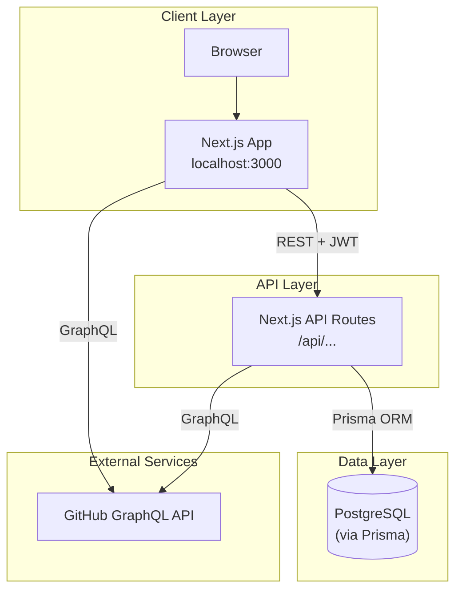
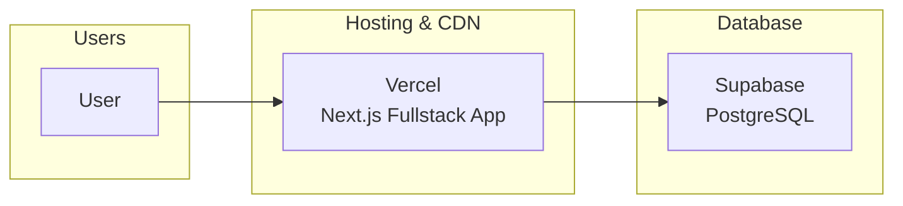
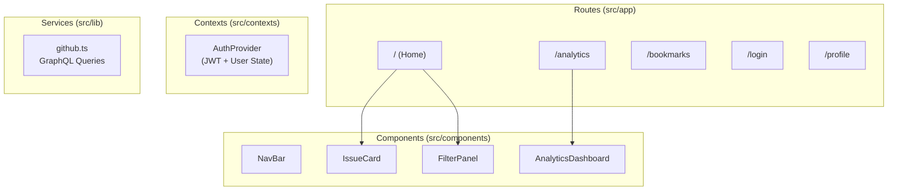
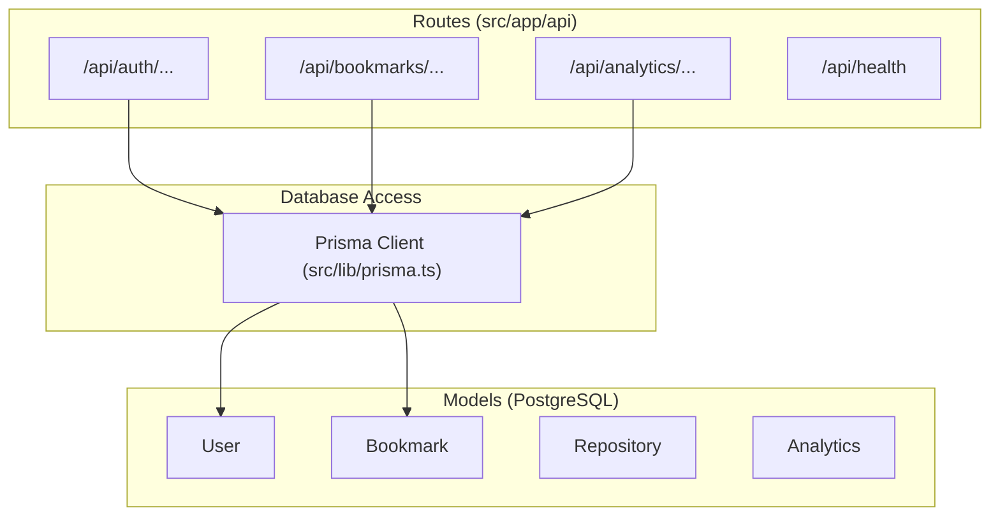
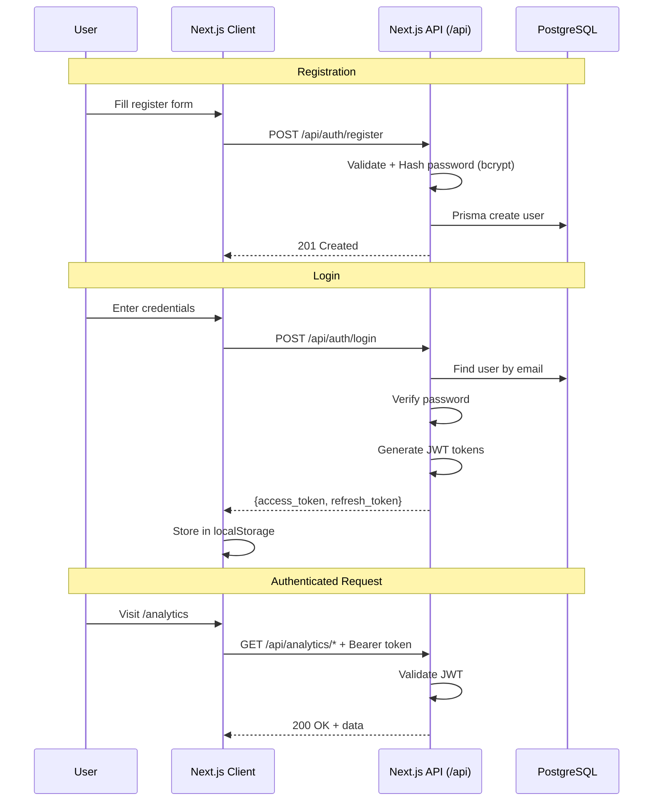
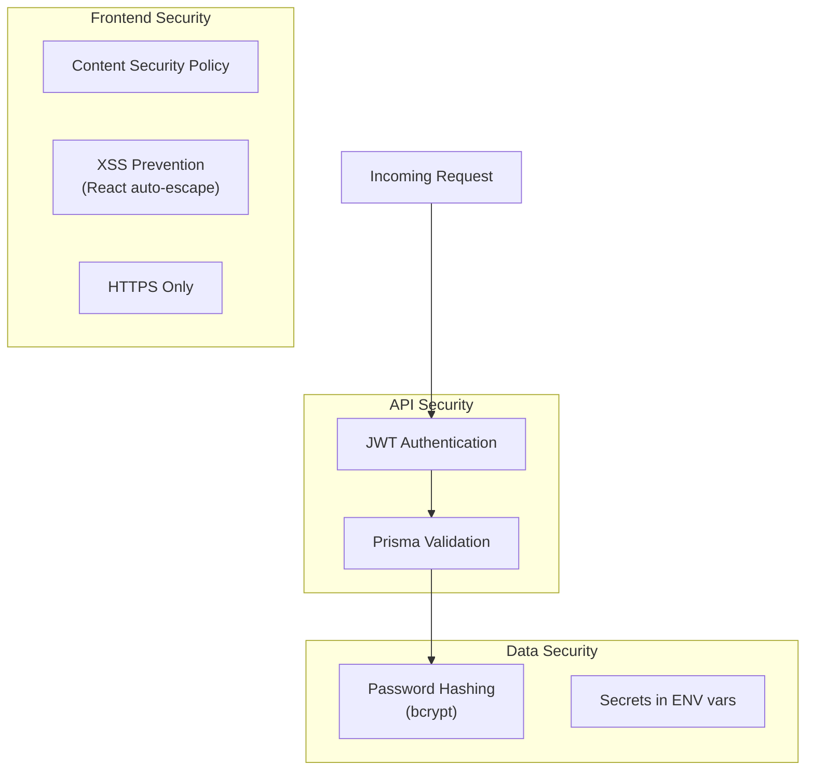

# First Issues - Architecture Documentation

## System Overview



---

## Production Deployment



---

## Frontend Architecture (Next.js App Router)



---

## Backend Architecture (Next.js API Routes)



---

## Authentication Flow



---

## Security Architecture



---

## Directory Structure

```
first-issues/
├── prisma/                       # Database ORM
│   └── schema.prisma            # Database models
├── public/                       # Static assets
├── src/                          # Application Code
│   ├── app/                      # Next.js App Router
│   │   ├── api/                  # Backend API routes
│   │   ├── analytics/            # Pages
│   │   ├── bookmarks/            
│   │   ├── login/                
│   │   └── ...                   
│   ├── components/               # React components
│   ├── contexts/                 # Auth & Theme context
│   ├── lib/                      # Backend & shared logic (Prisma, GitHub)
│   ├── types/                    # TypeScript interfaces
│   └── utils/                    # Utility functions
└── docs/                         # Documentation
    └── architecture.md           # This file
```

---

## Technology Stack

| Layer        | Technology            | Purpose               |
| ------------ | --------------------- | --------------------- |
| **Fullstack**| Next.js 16 (App Router)| Routing & API         |
| **Styling**  | Tailwind CSS          | Utility-first CSS     |
| **Auth**     | JWT (jose)            | Stateless Auth        |
| **Database** | PostgreSQL (Supabase) | User data, bookmarks  |
| **ORM**      | Prisma                | Database access       |
| **API**      | GitHub GraphQL        | Issue data            |
| **Hosting**  | Vercel                | Full application deployment |
