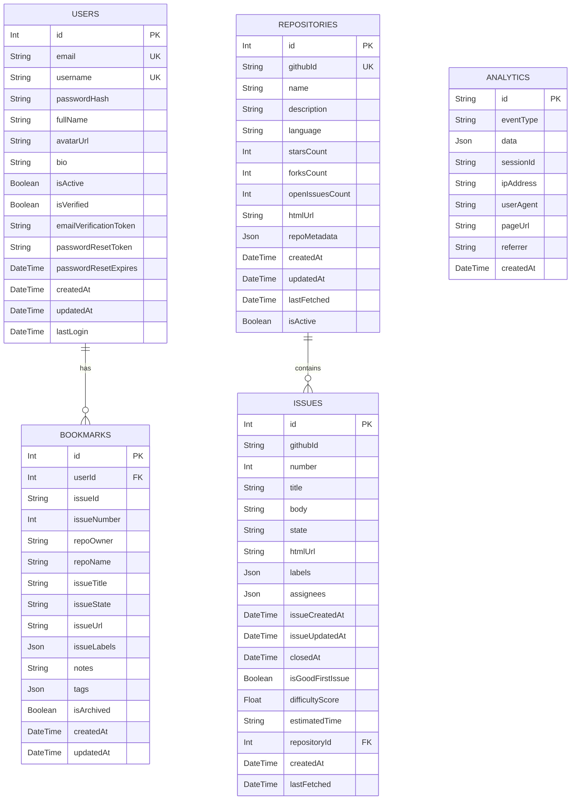

# Database Schema

Entity-relationship diagram for the First Issues database, now managed by **Prisma**.

---

## Index Strategy (Prisma)

Indexes are explicitly defined in `prisma/schema.prisma` using `@@index()` directives.

| Table          | Indexed Columns                                            | Purpose               |
| -------------- | ---------------------------------------------------------- | --------------------- |
| `User`         | `email`, `username`                                        | Fast login lookup     |
| `Repository`   | `name`, `language`, `starsCount`                           | Search/filter         |
| `Issue`        | `githubId`, `state`, `isGoodFirstIssue`, `repositoryId`    | Query optimization    |
| `Bookmark`     | `userId`, `issueId`, `createdAt`                           | User bookmarks lookup |
| `Analytics`    | `eventType`, `createdAt`                                   | Analytics queries     |

## Unique Constraints
- `User`: `email`, `username`
- `Repository`: `githubId`
- `Bookmark`: Unique combination of `[userId, issueId]`
