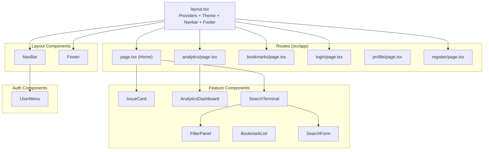
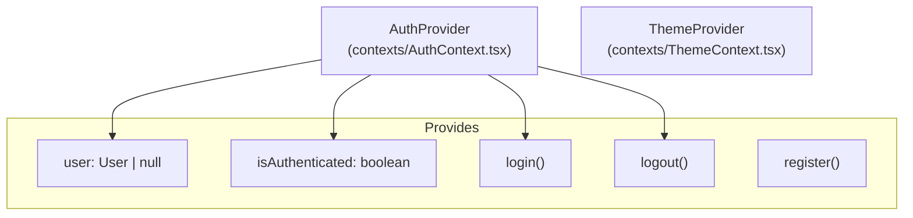

# Frontend Components

## Component Hierarchy

---

## Key Components

### NavBar

- Displays logo, navigation links
- Shows user menu when authenticated
- Login/Register links when not authenticated

### IssueCard

- Displays GitHub issue details
- Bookmark button
- Labels with colors
- Difficulty indicator

### SearchTerminal

- Main search interface on the home page
- Integrated with `SearchForm` and `FilterPanel`
- Handles mobile and desktop variants
- Debounces search inputs and updates URL search parameters

### AnalyticsDashboard

- Tabs: Overview, Repositories, Recommendations
- Language distribution chart
- Repository stats cards
- Filter by language

### FilterPanel

- Language filter
- Stars filter
- Date range
- Checkboxes for "Assigned", "Has Pull Requests", "Bookmarked"

---

## Context Providers

---

## Custom Hooks

| Hook                | Purpose                  |
| ------------------- | ------------------------ |
| `useAuth()`         | Access auth context      |
| `useBookmarks()`    | Bookmark CRUD operations |

---

## Styling

- **Framework**: Tailwind CSS
- **Theme**: Dark and light mode support via CSS variables
- **Design System**: Clean, modern interface
- **Fonts**: Inter (Sans) and Fira Code (Mono)
- **Components**: Radix UI primitives and custom elements
